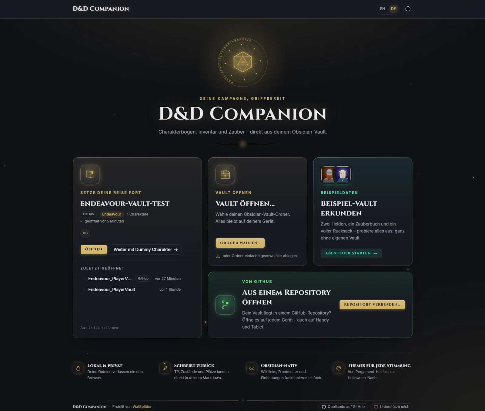
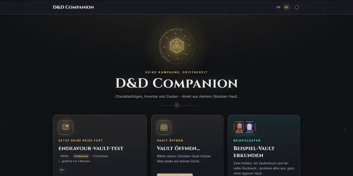
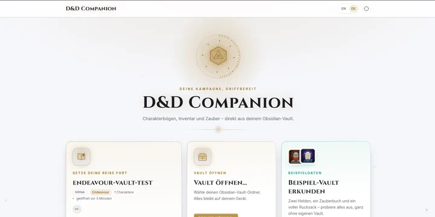
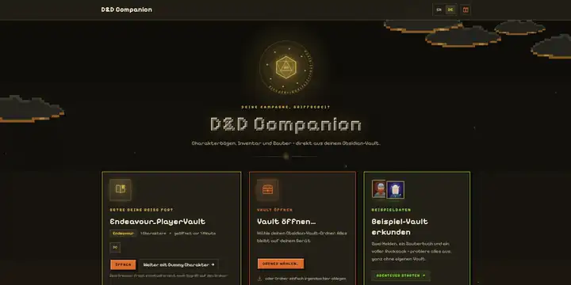
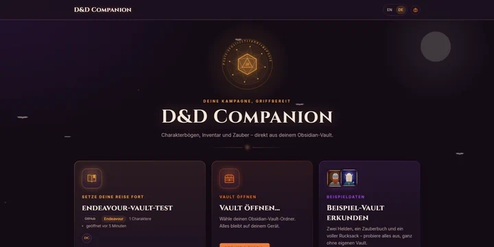
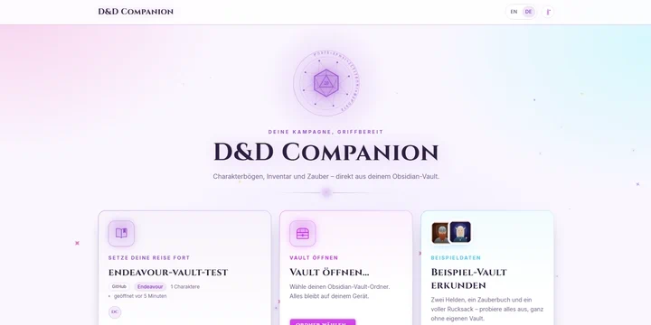
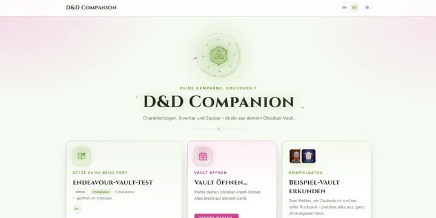
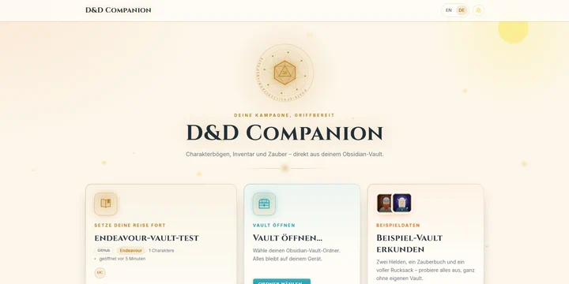
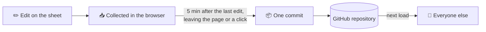

<div align="center">

<picture>
  <source media="(prefers-color-scheme: dark)" srcset="docs/logo-dark.svg">
  
</picture>

# D&D Companion

**A D&D character sheet that lives inside your Obsidian vault.**

Point it at your vault, a folder on your device or your group's GitHub repository,<br>
and your characters, items and spells turn into an interactive sheet.<br>
No server · no database · no account.

[](https://walsplitter.github.io/dnd-companion-web/)

[](LICENSE)


[Features](#features) · [Themes](#themes) · [Quick start](#quick-start) · [Opening your vault](#opening-your-vault) ·
[Syncing with GitHub](#syncing-with-github) · [Browser support](#browser-support) ·
[Vault formats](#vault-formats) · [Development](#development) · [Roadmap](#roadmap)

</div>

<br>

<p align="center">
  
</p>

## Features

<table>
<tr>
<th width="33%">🎲 On the sheet</th>
<th width="33%">📜 With your vault</th>
<th width="33%">🏰 Around it</th>
</tr>
<tr>
<td valign="top">

**Derived stats.** Modifiers, saves, skills, passive perception and spell DC are computed, never
duplicated.

**Dice roller.** Click any value like `1d8`, `2d6+3` or `1W6` to roll it.

**Spells and resources.** Slots, known spells, class pools, luck points and exhaustion.

**Slot-grid inventory.** Drag items between backpacks and pouches, track charges, add temporary
items, and equip gear on a character screen with body slots.

**Biography.** Portrait, profile, appearance, backstory and personality on a tab of their own.

</td>
<td valign="top">

**Reads it directly.** Frontmatter and `[[Wikilinks]]`, with hover previews like in Obsidian.

**Writes back, safely.** Edits are patched into the exact YAML key; formatting and comments stay.
Failed writes are rolled back.

**Straight from GitHub.** On any device, phones included, saved as tidy
[commits](#syncing-with-github).

**Three formats.** Native, "Endeavour"/Nimble and an older German sheet
([details](#vault-formats)).

</td>
<td valign="top">

**Picks up where you left off.** Reopen a recent vault straight at the last character.

**The whole party.** Cards, a compact list or a lineup by front, middle and back line, plus a
comparison of everyone's values.

**Easy navigation.** Breadcrumbs to the list and start page; step between characters.

**Themes and languages.** Eight colour themes and seven animated [topic themes](#themes); English
and German.

**Fast and light.** A static bundle; the sheet loads on first visit.

</td>
</tr>
</table>

## Themes

Pick a theme from the swatch button in the header. Besides eight colour palettes there are seven
**topic themes** that bring their own backdrop, panel ornaments and a subtle ambient animation:
drifting souls, bats, snow, falling petals, an 8-bit knight. The sparkle button next to them switches the animation
off; it also stays off for anyone who has *reduce motion* set in their system.

<table>
  <tr>
    <td width="25%"></td>
    <td width="25%"></td>
    <td width="25%"></td>
    <td width="25%"></td>
  </tr>
  <tr>
    <td align="center"><sub>Dark</sub></td>
    <td align="center"><sub>Light</sub></td>
    <td align="center"><sub>🏰 Pixel Quest</sub></td>
    <td align="center"><sub>🎃 Halloween</sub></td>
  </tr>
  <tr>
    <td></td>
    <td></td>
    <td></td>
    <td></td>
  </tr>
  <tr>
    <td align="center"><sub>🦄 Unicorn</sub></td>
    <td align="center"><sub>🌸 Spring</sub></td>
    <td align="center"><sub>☀️ Summer</sub></td>
    <td align="center"><sub>✨ …and ten more</sub></td>
  </tr>
</table>

## Quick start

**Open <https://walsplitter.github.io/dnd-companion-web/>.** There is nothing to install. Then pick
one of the three cards on the start page:

1. **Explore the sample vault** to look around without a vault of your own.
2. **Choose folder…** for a vault [on your device](#from-a-folder-on-your-device).
3. **Open from a repository** for a vault [on GitHub](#from-a-github-repository).

> [!TIP]
> The sample is a small German "Endeavour" player vault: an Arkanistin with a spell sheet and a
> Krieger with exhaustion and temporary HP, with inventories, portraits, class, rule and item notes
> ([`src/sample-vault/`](src/sample-vault)). Editing is always on there so every control can be tried,
> but nothing is saved: a reload or the **Reset** button next to the "Demo" badge restores it.

The app is only *served* from GitHub Pages; your vault is read in the browser and not uploaded
anywhere. Every push to `main` redeploys it ([`deploy.yml`](.github/workflows/deploy.yml)).
Step-by-step guides for players and DMs are in the
[wiki](https://github.com/WalSplitter/dnd-companion-web/wiki).

## Opening your vault

| | 📁 From a folder | ☁️ From GitHub |
| --- | --- | --- |
| **Where the vault is** | a folder on your device | a GitHub repository |
| **Devices** | desktop | any, phones and tablets included |
| **Saving changes** | straight into the files (Chrome, Edge) | as commits under your account (any browser) |
| **You need** | nothing | a GitHub account and an access token |

### From a folder on your device

1. Click **Choose folder…**, or drop the vault folder anywhere on the start page.
2. To save changes, click **Edit** (the lock) in the header. The browser asks for permission once.

The vault is only read, and only written while editing is on. Saving to a folder needs Chrome or
Edge ([why](#browser-support)).

### From a GitHub repository

Click **Open from a repository** and fill in:

| Field | What to enter |
| --- | --- |
| **Repository** | `owner/repo`, or paste its GitHub URL. A `…/tree/<branch>/<folder>` URL fills in the next two fields. |
| **Branch** | optional; the default branch if left empty |
| **Vault folder** | optional; the vault's folder inside the repository, e.g. `Endeavour_PlayerVault` |
| **Access token** | see [For each player](#for-each-player-create-an-access-token) |

The vault then appears on the start page with a **GitHub** badge and reopens without the token,
until the token expires. Set it up once per browser and device.

## Syncing with GitHub

A group that keeps its vault in a GitHub repository can use it straight from there. Every player
opens it in their browser and saves their changes back as commits
([#8](https://github.com/WalSplitter/dnd-companion-web/issues/8)).



### For the repository owner (usually the DM)

1. **Put the vault in a GitHub repository.** Public or private. A *public* repository can be read by
   anyone, with or without the app.
2. **Add every player who should save changes as a collaborator:** **Settings → Collaborators → Add
   people**, with write access. Players who only *read* a public repository need no access.
3. **Let the app commit to the branch.** It pushes straight to the branch, not through pull
   requests. Keep rules that require pull requests or reviews off that branch, or give the players
   their own branch.

> [!TIP]
> **Move the repository into a GitHub organization** (free). GitHub does not let fine-grained tokens
> *write* to a repository in someone else's personal account. In an organization, players can use a
> fine-grained token limited to just this repository. Under the organization's **Settings →
> Personal access tokens**, allow fine-grained tokens, and approve the players' tokens if approval is
> required.

### For each player: create an access token

Every player creates **their own** token. Commits then show who changed what, and a token can be
revoked without locking anyone else out. **Never share a token.**

| The repository is in … | To read only | To read and save |
| --- | --- | --- |
| your own account or an organization you belong to | fine-grained, **Contents: Read-only** | fine-grained, **Contents: Read and write** |
| someone else's personal account (you are a collaborator) | public: any token; private: classic, `repo` | classic, `public_repo` (public) or `repo` (private) |

<details>
<summary><b>Create a fine-grained token</b> (recommended)</summary>
<br>

GitHub → **Settings → Developer settings → Personal access tokens → Fine-grained tokens → Generate
new token** ([direct link](https://github.com/settings/personal-access-tokens/new)):

- **Resource owner:** the account or organization that owns the vault repository.
- **Expiration:** a date, e.g. the end of the campaign season.
- **Repository access:** **Only select repositories** → the vault repository.
- **Permissions → Add permissions → Contents:** **Read and write** (or **Read-only**). GitHub adds
  **Metadata: Read-only** by itself. Nothing else is needed.

</details>

<details>
<summary><b>Create a classic token</b> (repository in someone else's personal account)</summary>
<br>

Same place, **Tokens (classic) → Generate new token (classic)**. Tick only `public_repo` (public
repository) or `repo` (private) and set an expiration.

> [!WARNING]
> A classic token can push to *every* repository you have write access to, your own included. Keep
> its expiry short and use it only for this app.

</details>

> [!NOTE]
> Why a token even for a public repository? Without one, GitHub allows only 60 requests an hour, and
> loading a vault takes one per note. Any token lifts that, even one with no permissions.

### Saving changes

Switch on **Edit** (the lock in the header). This also checks that your account may push. Edits
show up at once and are collected; everything collected goes into **one commit** under your
account:

- ⏱️ about **5 minutes after your last change** (each change restarts the wait),
- 🚪 when you leave the page or switch to another app,
- ☁️ or when you click the cloud counter in the header.

Rapid clicks never turn into a stream of commits, and a value changed back needs no commit at all.
If the tab closes first, the unsaved edits stay in the browser and go out on the next visit.

The **cloud** next to the lock shows where things stand:

| Cloud shows | Meaning |
| --- | --- |
| ✓ check mark | everything is saved |
| ↑ arrow and a number | unsaved changes; click to save now |
| ⟳ spinning | saving |
| red | saving failed; click to retry, the tooltip says why |
| orange | conflict, see below |

**When teammates edit too.** Each commit builds on the branch as it is *now*: the edited notes are
re-read and only the keys you changed are patched in, so whatever others pushed meanwhile is kept.
If someone changed the *same* value, nothing is saved. A dialog shows both values, and you pick
whose win.

<details>
<summary><b>What the commits look like</b></summary>
<br>

Conventional Commits with the character as scope, naming the player and the app:

```
chore(dummy-charakter): update hp and mana

Dummy Charakter:
- hp.current: 14 → 13
- spellcasting.mana.current: 9 → 7

Edited-by: @WalSplitter
Via: D&D Companion <https://github.com/WalSplitter/dnd-companion-web>
```

</details>

### Privacy and security

> [!IMPORTANT]
> The token is stored **in this browser only** (IndexedDB) and sent **only** to `api.github.com`,
> which the app talks to directly. There is no server in between.

- Notes and images are cached in the browser by content hash, so the next visit only downloads what
  changed.
- **Remove from list** on the start page forgets the repository and its token. Revoke a token on
  GitHub when you no longer need it.

## Browser support

| Feature | Chrome, Edge, Opera | Firefox, Safari |
| --- | :---: | :---: |
| Open a vault folder and view characters | ✅ | ✅ |
| Save changes to a vault folder | ✅ | ❌ |
| Recent folders on the start page | ✅ | ❌ |
| Drop a vault folder onto the start page | ✅ | ❌ |
| **Open a vault from GitHub and save changes** | ✅ | ✅ |

Saving to a folder needs the
[File System Access API](https://developer.mozilla.org/en-US/docs/Web/API/File_System_API), which
only Chromium-based browsers have.

- **Chrome, Edge, Opera** remember the last five vaults and reopen them with one click (the browser
  may ask to re-grant folder access). Links to a character reopen the last vault automatically.
- **Firefox and Safari** open folders read-only, through a picker that must be used again each
  session. The header marks such a vault **Read-only**. Vaults from GitHub work fully.

> [!NOTE]
> **Brave** is Chromium-based but turns the API off by default. Enable it under
> `brave://flags/#file-system-access-api` to save to folders.

## Vault formats

The app recognises several character-file shapes, and they can all live in the same vault. The
detected ruleset (a best guess, `src/vault/detectRuleset.ts`) is shown on the start page and in the
tooltip of the vault name in the header.

<details>
<summary><b>1. Native schema</b> (<code>type: character</code> / <code>item</code> / <code>spell</code>)</summary>
<br>

The app's own frontmatter format (full shape in `src/vault/types.ts`). Items and spells are separate
notes, referenced from a character via `[[Wikilinks]]`:

```yaml
---
type: character
name: Elandra Windrider
class: [{ name: Wizard, level: 5, subclass: School of Evocation }]
species: Elf (High Elf)
background: Sage
alignment: Neutral Good
experience: 6500
abilities: { str: 8, dex: 14, con: 13, int: 17, wis: 12, cha: 10 }
proficiency_bonus: 3
saving_throw_proficiencies: [int, wis]
skill_proficiencies: [arcana, history]
skill_expertise: [arcana]
armor_class: 12
speed: 30 ft
hp: { current: 27, max: 38 }
hit_dice: { die: d6, total: 5, used: 1 }
inventory:
  equipped: ["[[Quarterstaff]]"]
  carried: ["[[Spellbook]]"]
currency: { gp: 45 }
spellcasting: { ability: int, slots: { "1": { max: 4, used: 1 } } }
spells_known: ["[[Fire Bolt]]"]
features: [{ name: Arcane Recovery, source: Wizard 1, description: "..." }]
---
```

Derived numbers are computed from these raw values (`src/vault/deriveStats.ts`). `speed` accepts
feet (`30 ft`), metres (`9 m`, 1.5 m per square) or squares (`6 Felder`). See
[`src/sample-vault/`](src/sample-vault) for complete, Endeavour-flavoured examples.

The **Biography** tab reads optional roleplay fields
([`biography.ts`](src/vault/adapters/biography.ts)): `personality` (a list or a text), `ideals`,
`bonds`, `flaws` and `appearance`, either a text or a map such as `{ age: 112, height: 1,35 m, eyes:
grau }` (`gender`, `age`, `size`, `height`, `weight`, `eyes`, `hair`, `skin`; other keys are shown
as written). The older German blocks `Persönlichkeit` (`Persönlichkeitsmerkmale`, `Ideale`,
`Bindungen`, `Makel`) and `Aussehen` (`Geschlecht`, `Alter`, `Größe`, …) work too. The backstory
is `backstory:`, or else the note body. The tab only appears when there is something to show.

The party **lineup** on the character list places each character by the main class (melee classes
in front, skirmishers and support casters in the middle, full casters at the back;
[`formation.ts`](src/features/character-list/formation.ts)). `formation: front | middle | back`
(or `vorne` / `mitte` / `hinten`) overrides it.

Notes under a path containing `vorlage` (e.g. `Kampagne/Gruppe/_Vorlage Charakter/`) are treated
as blank templates: they never show up as characters or spells, even with `type: character`, but
links to them still resolve.

The `inventory` lists can be edited in the app: items are searched in the vault, added to either
list, removed, and moved between `equipped` and `carried` (see
[`listInventory.ts`](src/features/inventory/listInventory.ts)); the whole block is written back.

`endeavour_inventory`, `inventory`, `currency`, `spellcasting` and `spells_known` don't have to live on the
character's own file: they are also read from separate notes that link back via
`Charakter: "[[<character file name>]]"` (see `resolveLinkedFields()` in
[`nativeCharacter.ts`](src/vault/adapters/nativeCharacter.ts)). A field set directly on the
character's file always takes priority.

</details>

<details>
<summary><b>2. "Endeavour"</b>: a from-scratch Nimble ruleset</summary>
<br>

Uses the native `type: character` marker but a genuinely different underlying ruleset, layered on
additively:

- **Items** ([`endeavourItem.ts`](src/vault/adapters/endeavourItem.ts)) are detected by tag
  (`Gegenstand/Waffe|Rüstung|Schild|Magischer_Gegenstand|Behälter|Ausrüstung`, bare `Werkzeug`) and
  kept in their own `Vault.endeavourItems` collection, because the tag scheme overlaps with the
  legacy adapter's weapon/armour detection.
- **Slot-grid inventory** (`character.endeavour_inventory`,
  [`EndeavourInventoryGrid.tsx`](src/features/inventory/components/EndeavourInventoryGrid.tsx)):
  containers have a `Plaetze` capacity; items cost one or more slots and are placed as tiles.
  Container contents are written back to the owning file.
- **Attributes and skills** (`nimble_attributes` / `nimble_skills`): eight attributes valued −5…+5
  and used directly as the roll modifier, with the 18 skills reassigned to the attribute that governs
  them. The Ability Scores / Skills / Saving Throws cards render this shape whenever it is present.
  `abilities` / `proficiency_bonus` are optional: armor class is the worn armor's `RK`, initiative
  is split into turn order (IN) and starting AP (BW), and the spell DC is `8 + attribute` without a
  proficiency bonus.
- **Armor and evasion**: `armor: "[[Kettenhemd]]"` (or `Rüstung:`) links the worn armor note; its
  "Max BW" (`BW_cap` on the note) caps the BW part of the evasion value (`10 + BW`). The cap is never
  read from the character file itself. `shield: "[[Holzschild]]"` (or `Schild:`) links the shield,
  whose `RK` is only the Block bonus.
- **Equipment** ([`EquipmentLoadout.tsx`](src/features/inventory/components/EquipmentLoadout.tsx),
  [`equipment.ts`](src/features/inventory/equipment.ts)): a character screen with body slots for
  head, necklace, armor, belt, boots, cloak, shield, gloves and two rings (`head`, `cloak`,
  `gloves`, `belt`, `boots`, `necklace`, `rings` on the character, German keys accepted) plus the
  weapons in `attacks`. Equipping moves an item out of its container (equipped gear takes no
  slots); a taken slot swaps the old item back. Wearables are assigned to a slot by a
  `Trageplatz:` field, a `Gegenstand/Kleidung/<Platz>` tag, or a magic item's `Art`; armor with a
  `Trageplatz` (e.g. a helm with `Trageplatz: Kopf`) goes to that slot instead of the body.
  The silhouette shows the body armor by its `Klasse` (clothing such as `Trageplatz: Kleidung`,
  `Leicht`, `Mittel`, `Schwer`) and the weapon by its `Gegenstand/Waffe/<Form>` tag or name (sword,
  dagger, axe, mace, staff, polearm, bow, crossbow); a second one-handed weapon goes into the off
  hand when no shield is carried.
- **TP / RP without hit dice**: Nimble characters have no hit dice (a `hit_dice` block is ignored).
  Following the DM's class notes, level 1 grants `(BasisTP + KO) × 2` TP and every further level
  `BasisTP + KO`, so max TP is `(level + 1) × (BasisTP + KO)`; RP likewise with `BasisRP` and half EN
  rounded down. `BasisTP` / `BasisRP` are read from the note named like the class (a subclass note's
  own values add on top). Without a class note declaring them, the sheet's own `hp.max` /
  `resilience.max` are used.
- **Weapon attacks**: `attacks: ["[[Kampfstab]]", "[[Dolch]]"]` links weapon notes; damage, damage
  type, range and properties come from the note, the bonus from the attributes (melee and thrown ST,
  ranged GE, `Finesse` the higher of ST/GE). A note with both a melee and a ranged profile yields two
  attacks ("Dolch" and "Dolch (Wurf)"). Written-out attack objects still work for attacks without a note.
- **Class notes**: besides the pools, the note named like the class supplies `Kernattribute`
  (highlighted as core attributes), `Rettungswürfe.Vorteil` / `.Nachteil` (those saves are marked and
  rolled with advantage/disadvantage by default) and `Übung.Waffen` / `.Rüstungen` (listed on the
  Senses & Languages card).

</details>

<details>
<summary><b>3. Legacy adapter</b>: an older German-language vault</summary>
<br>

An older vault predating this app uses a different schema with no `type:` marker (nested
`Attribute` / `Rettungswürfe` / `Fertigkeiten` objects, Dataview-flavoured formulas, items in
markdown tables inside a linked `Inventar <Name>.md`). The app detects it structurally (skipping the blank sheets in
`vorlage` folders) and normalises it on the fly ([`legacyCharacterSheet.ts`](src/vault/adapters/legacyCharacterSheet.ts)); nothing in
the source vault is modified except through explicit edits.

This adapter is best-effort, not full fidelity:

- Hit die comes from the linked class file's `Trefferwürfel`, falling back to `d8`.
- Feature descriptions use the first summary line of the linked feature note.
- Armor class is `Natürliche_Rüstung + Zusätzliche_Rüstung + DEX modifier` when present, otherwise
  `10 + DEX modifier`; equipped-armour item stats are not cross-referenced.
- Inventory and currency come from a sibling file whose `Charakter` field links back to the
  character.
- Spellcasting is read from the character file or a linked spell sheet, whichever carries
  `Zauber` / `Zauberplätze`.

</details>

## Development

Requires [Node.js](https://nodejs.org) 20+.

```bash
git clone https://github.com/WalSplitter/dnd-companion-web.git
cd dnd-companion-web
npm install
npm run dev              # http://localhost:5173
npm run dev -- --host    # also reachable from a phone in the same network
```

| Script | What it does |
| --- | --- |
| `npm run dev` | start the dev server |
| `npm run build` | type-check and build for production |
| `npm run preview` | serve the production build |
| `npm run test` / `test:watch` | run the tests (Vitest), once or on every change |
| `npm run lint` | lint (oxlint) |

<details>
<summary><b>Production build and self-hosting</b></summary>
<br>

For regular use at the table rather than development, build once and serve the static bundle:

```bash
npm run build
npm run preview    # http://localhost:4173
```

The build does not reload on code changes; rerun the commands after pulling updates. Any static file
server works for `dist/` as long as it falls back to `index.html` for unknown paths (the app uses
client-side routing), e.g. `npx serve -s dist`. Opening `dist/index.html` directly from disk does not
work.

</details>

<details>
<summary><b>Architecture</b></summary>
<br>

```
src/
├── vault/        parsing pipeline: raw frontmatter -> adapters -> normalised Vault, wikilink index,
│   │              derived stats, ruleset detection
│   ├── adapters/  one detect()/normalize() pair per format (native, legacy, Endeavour items)
│   ├── github/    GitHub repository as a vault source: REST client, loader, blob cache, commit sync
│   └── writeback/ surgical YAML patching, so edits keep the note's formatting
├── store/        zustand stores: vault (load, recent vaults, optimistic edits + rollback) and error log
├── features/     character-list, character-sheet, inventory (slot grid), spells
├── components/   shared UI building blocks
├── dice/         dice notation parser and roll button
├── i18n/         English / German dictionaries
├── theme/        theme tokens, topic themes and switcher
├── routes/       start page, vault layout (breadcrumbs, deep-link restore), character list and sheet
└── sample-vault/ bundled demo vault (notes + portraits), opened from the start page
```

Every format goes through the same pipeline: `buildVault()` in `src/vault/parseFrontmatter.ts`
parses each file's frontmatter, then hands it to the first adapter whose shape matches. Adapters
share the defensive field readers in `src/vault/frontmatterFields.ts` and the pure wikilink string
helpers in `src/vault/wikilinkSyntax.ts`. The rest of the app (derived stats, sheet UI, inventory,
spells) is format-agnostic.

Edits go through one `VaultWriter` interface (`src/vault/writeback/persist.ts`): a local folder
writes files through their handles, a GitHub vault queues the edits and commits them
(`src/vault/github/githubSync.ts`).

**Adding another format:** add a `detect()` + `normalize()` pair under `src/vault/adapters/` that
maps the new shape onto `CharacterFrontmatter` (or its own parallel collection if merging would
change behaviour for an already supported vault) and wire it into `buildVault()`. The original
analysis behind the Endeavour support lives in
[`docs/inventory-vault-alignment.md`](docs/inventory-vault-alignment.md).

</details>

**Tech stack:** React 19, TypeScript, Vite, Tailwind CSS 4, React Router, zustand, js-yaml, Vitest,
oxlint.

## Roadmap

Planned work is tracked in [GitHub issues](https://github.com/WalSplitter/dnd-companion-web/issues):

- [#12](https://github.com/WalSplitter/dnd-companion-web/issues/12) Offline use as a PWA
  (`vite-plugin-pwa`), including the last vault opened from GitHub.

## License

[MIT](LICENSE)
